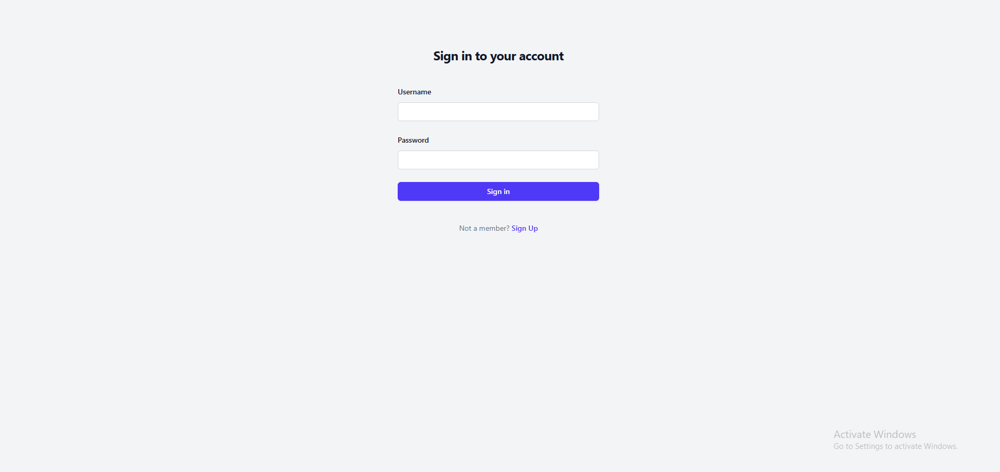
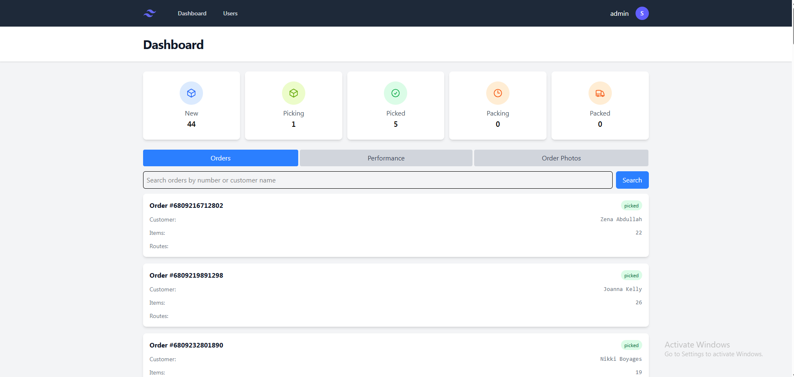
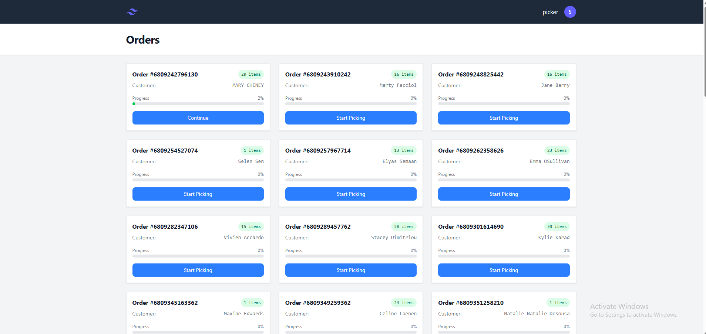
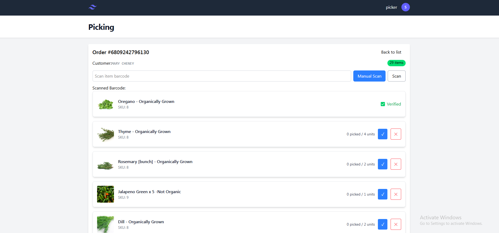
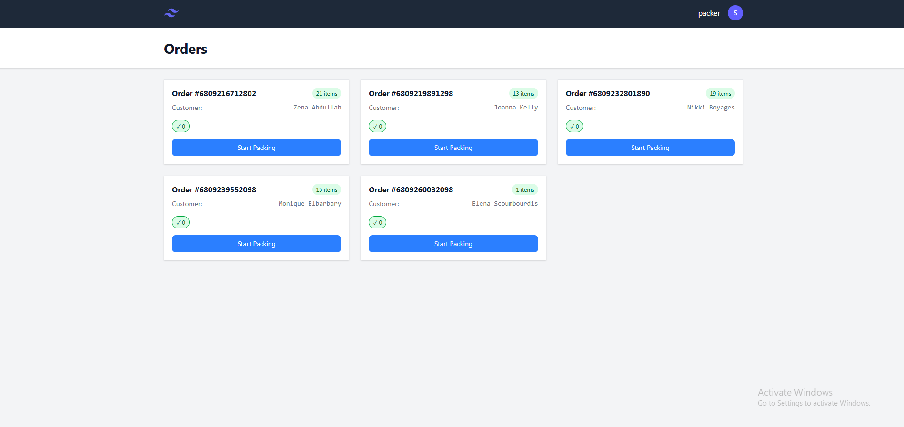
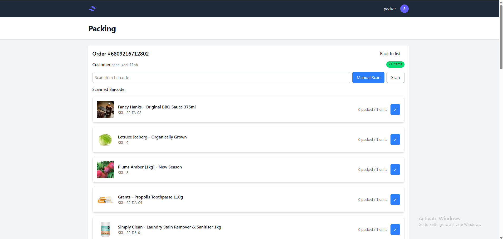

# 🧺 Pick & Pack App — Frontend

A mobile-first React-based web app designed for warehouse pickers, packers, and admins to manage Shopify order fulfillment with barcode scanning, role-based views, and real-time updates.

---
## 📦 Features

- 🔐 **Role-based Authentication** (Admin, Picker, Packer)
- 📋 **Smart Order Management** (assignment, status tracking)
- 📷 **Product Display** with images and SKU
- 📦 **Barcode Scanning** during picking and packing
- ✅ **Pick/Pack Validation**
- 🖨️ **Label Printing**
- 🔔 **Slack/Webhook Notifications**
- 🧑‍💼 **Admin User Management**
- 📱 **Mobile-First UI** (Tailwind CSS)

---

## 📁 Project Structure
<pre lang="text">
    src/│ 
        ├── assets/ # Static assets like icons and images 
        ├── components/ # Reusable UI components 
        ├── layouts/ # App layout (with header, footer, sidebar) 
        ├── pages/ # Page-level components (Dashboard, Users, Orders) 
        ├── services/ # API functions (Shopify, Auth, Orders) 
        ├── utils/ # Helper functions 
        ├── hooks/ # Custom React hooks 
        ├── context/ # React context (AuthProvider, RoleContext) 
        ├── App.jsx # App entrypoint with routes
        ├── main.jsx # Root render file 
        └── tailwind.config.js
</pre>

---

# Tailwind CSS config

---

## 🚀 Getting Started

### 1. Clone the Repository
```bash
git clone https://github.com/shermanluong/warehouse.git
cd warehouse
```
### 2. Install Dependencies
```bash
npm install
```
### 3. Setup Environment
```bash
VITE_API_BASE_URL=http://localhost:3000/api
```
Update the URL to point to your backend.

### 4. Run the App
```bash
npm run dev
```
App will be available at: http://localhost:5173

## 👥 Roles & Access
| Role                      | Permissions                                        |
|---------------------------|----------------------------------------------------|
| Admin                     | View/edit users, assign pickers, view all orders   |
| Picker                    | See assigned orders, scan items to pick            |
| Packer                    | See picked orders, verify & complete packing       |

## 🧪 Testing
To be added...

## 📸 Screenshots
### 🔑 Login


### 🛠️ Admin Dashboard


### 🧺 Picker Order View


### 🛒 Picking Items View


### 📥 Packer Order View


### 📦 Packing Items View


## 🛠️ Tech Stack
- React
- Vite
- Tailwind CSS
- React Router
- Context API
- GraphQL (via backend API)

## 🤝 Contributions
Contributions welcome! Please open an issue or submit a pull request.

## 📄 License
MIT License

## 🔗 Related Projects
- warehouse-backend